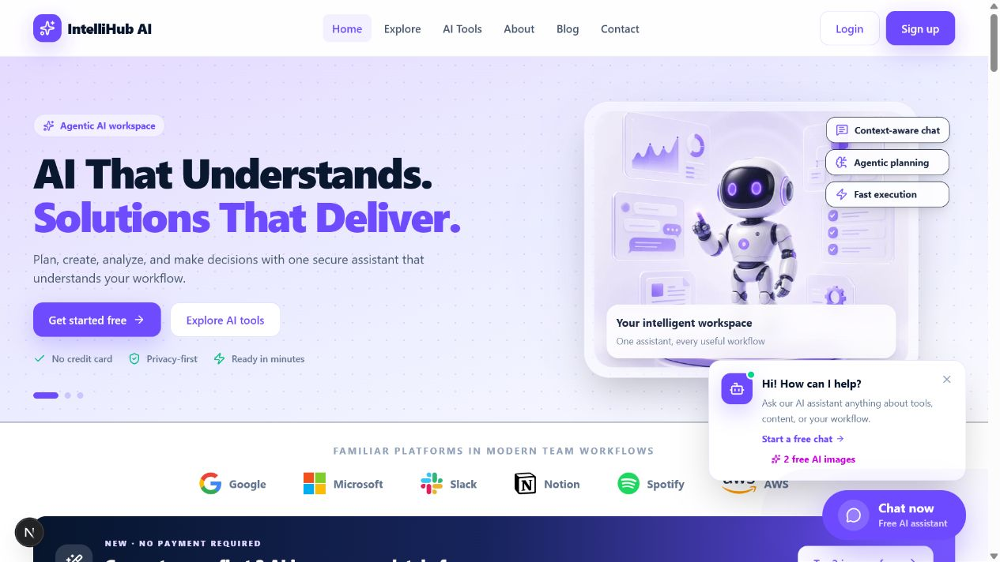

# IntelliHub AI

IntelliHub AI is a full-stack agentic AI SaaS workspace for discovering AI tools, holding context-aware conversations, generating content, understanding documents, and receiving explainable recommendations. It uses a separate Next.js client and Express API, MongoDB persistence, secure cookie-based JWT sessions, and a modular AI provider service with WalkAI and direct Gemini support.

## Main features

- Premium responsive landing page, reusable design system, navigation, footer, loading, empty, error, toast, modal, table, and pagination states
- Backend-powered tool search, filtering, sorting, price/rating filters, and URL-persisted exploration state
- Public tool details, gallery, related tools, ratings, reviews, and authenticated favorites
- Registration, email/password login, Google identity verification, demo login, access/refresh JWT rotation, roles, and ownership checks
- Authenticated tool creation, live preview, editing, deletion confirmation, publishing, and responsive management views
- MongoDB-backed dashboard with usage charts, category distribution, most-used tools, recent activity, and summary metrics
- Context-aware Gemini chat with separate conversations, limited recent history, secure internal tool context, copy, regenerate, stop, rename, and delete controls
- Explainable recommendation engine using goals, preferences, pricing, favorites, activity, refinement, and saved feedback
- Content generator for blog posts, product descriptions, social posts, email, and documentation with templates, length/tone controls, save, copy, regenerate, and TXT export
- Memory-only PDF, DOCX, and TXT processing with type/size validation, structured analysis, and downloadable reports
- Blog, contact, profile, about, help, privacy, and terms pages
- Helmet, scoped CORS, rate limiting, input validation, unsafe-key blocking, file validation, centralized errors, password hashing, and production-safe error responses

## Technology

**Client:** Next.js App Router, React, TypeScript, Tailwind CSS, TanStack Query, React Hook Form, Zod, Recharts, Lucide, Framer Motion, Sonner.

**Server:** Node.js, Express, TypeScript, MongoDB, Mongoose, JWT, bcrypt, Zod, Helmet, CORS, Morgan, express-rate-limit, Multer, pdf-parse, Mammoth, Google Auth Library, Gemini SDK.

## Project structure

```text
intellihub-ai/
├── client/
│   ├── public/images/
│   ├── src/app/
│   ├── src/components/
│   ├── src/lib/
│   ├── src/providers/
│   ├── src/services/
│   └── src/types/
├── server/
│   └── src/
│       ├── config/
│       ├── controllers/
│       ├── middlewares/
│       ├── models/
│       ├── prompts/
│       ├── routes/
│       ├── services/
│       ├── types/
│       └── utils/
├── package.json
└── README.md
```

## Local installation

Requirements: Node.js 20+, npm 10+, and MongoDB 7+ locally or a MongoDB Atlas connection.

```bash
npm install
copy client\.env.example client\.env.local
copy server\.env.example server\.env
npm run seed
npm run dev
```

On macOS/Linux, use `cp` instead of `copy`. The client runs at `http://localhost:3000` and the API at `http://localhost:5000`. API health is available at `GET /health`.

## Environment variables

Client (`client/.env.local`):

```env
NEXT_PUBLIC_API_URL=http://localhost:5000/api
NEXT_PUBLIC_GOOGLE_CLIENT_ID=
```

Server (`server/.env`):

```env
PORT=5000
NODE_ENV=development
MONGODB_URI=mongodb://127.0.0.1:27017/intellihub-ai
JWT_ACCESS_SECRET=replace-with-at-least-32-random-characters
JWT_REFRESH_SECRET=replace-with-another-32-random-characters
JWT_ACCESS_EXPIRES_IN=15m
JWT_REFRESH_EXPIRES_IN=7d
AI_PROVIDER=walkai
WALKAI_API_KEY=
WALKAI_BASE_URL=https://walkai.top/v1
WALKAI_MODEL=gemini-2.5-flash
GEMINI_API_KEY=
GOOGLE_CLIENT_ID=
GOOGLE_CLIENT_SECRET=
CLIENT_URL=http://localhost:3000
MAX_FILE_SIZE_MB=10
```

Never commit actual secrets. In production, use long random JWT secrets, HTTPS, a restricted CORS origin, and a managed secret store.

## AI provider setup

WalkAI is the default provider. Add the key shown in your WalkAI dashboard only to `server/.env`:

```env
AI_PROVIDER=walkai
WALKAI_API_KEY=sk-your-private-key
WALKAI_BASE_URL=https://walkai.top/v1
WALKAI_MODEL=gemini-2.5-flash
```

WalkAI controls which model names are available for each key group. If its **Use Key** instructions show a different model, replace only `WALKAI_MODEL`.

For direct Google Gemini instead:

1. Create a Gemini API key in Google AI Studio.
2. Set `AI_PROVIDER=gemini` and `GEMINI_API_KEY` only in `server/.env`.
3. Restart the Express server.

The provider boundary lives in `server/src/services/ai.service.ts`. Add another provider by implementing the same text-generation behavior there; browser code never receives provider credentials.

## Google sign-in

Create a Google OAuth web client, add `http://localhost:3000` as an authorized JavaScript origin, then place the same client ID in the client and server environment files. The browser sends the Google identity credential to Express, where it is verified against the configured audience before a local session is issued.

## Demo account and seed data

Run `npm run seed`, then use:

```text
Email: demo@intellihub.ai
Password: Demo12345!
```

The idempotent seed adds eight meaningful AI tools and three complete blog articles. Run it again safely after resetting a development database.

## API overview

All JSON responses follow `{ success, message, data?, error? }`.

```text
/api/auth              registration, login, Google, refresh, logout, current user
/api/users             profile and admin user listing
/api/tools             search, filter, sort, CRUD, ownership
/api/reviews           per-user ratings and comments
/api/favorites         saved tools
/api/conversations     conversation CRUD and context-aware messages
/api/recommendations   ranking, refinement, and interaction feedback
/api/content           generation and saved outputs
/api/documents         secure multipart analysis
/api/dashboard         MongoDB-derived workspace metrics
/api/contact           contact and newsletter submissions
/api/blogs             articles and article details
```

## Validation and production checks

```bash
npm run typecheck
npm run build
```

For production, set `NODE_ENV=production`, use HTTPS so secure cookies are enabled, configure MongoDB backups and indexes, limit Gemini quota, and place the API behind a reverse proxy with request logging and monitoring.

## Screenshots

<p align="center">
  
  
</p>

The responsive landing experience includes an animated three-slide hero, clear workflow CTAs, a floating assistant, and direct access to two free image generations.

## Deployment and repositories

- **Live website:** [intellihub-ai-client.vercel.app](https://intellihub-ai-client.vercel.app)
- **GitHub monorepo:** [GalibDev/intellihub-ai](https://github.com/GalibDev/intellihub-ai)
- **Frontend source:** [`client/`](https://github.com/GalibDev/intellihub-ai/tree/main/client)
- **Backend source:** [`server/`](https://github.com/GalibDev/intellihub-ai/tree/main/server)

The frontend and backend live in one production monorepo with independent Vercel and Render deployments.
